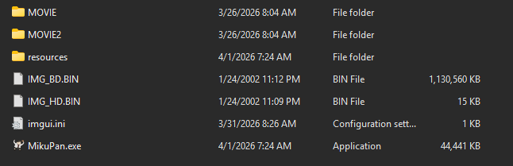

# What is MikuPan?
MikuPan is an in progress port of Fatal Frame 1 PS2 to PC running natively, no emulation. Still very early work.

# Build
For now, building in `debug` is highly recommended due to issues related to the `release` build. The build process was made to automatically fetch all required dependencies of the project.

## Assets
You need to copy the files `IMG_HD.BIN`, `IMG_BD.BIN` and folders `MOVIE` and `MOVIE2` from the NTSC-U (USA) ISO of Fatal Frame to the folder containing the `MikuPan` executable. 

PAL (EU), NTSC-J (Japan) ISOs will *NOT* work.
The executable will be located at `{CMake-Build-Directory}/MikuPan`.

## Windows
You need either `MinGW` or `Cygwin` with `gcc` and `CMake` in order to build `MikuPan`. `MSVC` will *NOT* work. 

## Linux
`GCC` and `CMake` required to build `MikuPan`.

## OSX
Not yet supported due to lack of hardware to test it, but it should be easily supported.

# Special Thanks
Thank you to prinsep for making the logo!
